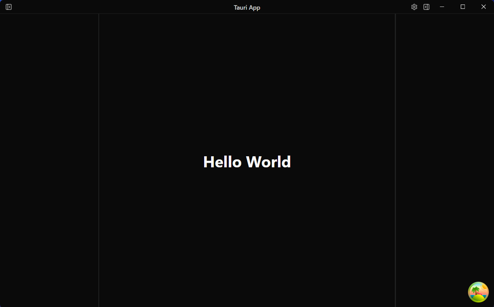

# Tauri React 模板


简体中文 | [English](README.md)

一个开箱即用的桌面应用模板，帮助您快速开始构建应用。

项目用于构建生产级 **Tauri v2**、**React** 和 **TypeScript** 应用。模板提供明确的工程约定，方便开发者和 AI 编程代理从一开始就按稳定架构协作。

> 项目由Danny的[tauri-template衍生](https://github.com/dannysmith/tauri-template)，因为Danny的项目构建越来越复杂，我希望初始模板更简单实用，一些依赖，后续开发可以按需添加。如果你寻找更加复杂的工业级模板，请看看Danny的工作。

## 为什么使用这个模板？

很多 Tauri starter 只提供空白项目。这个模板提供的是一个已经跑通的应用骨架，并带有清晰的工程模式：

- **类型安全的 Rust-TypeScript 桥接**：通过 tauri-specta 生成类型绑定。
- **工具链约束性能模式**：使用 Vite+、Oxlint、Oxfmt、React Compiler lint 和测试保障质量。
- **跨平台准备**：包含平台化标题栏、窗口控制和原生菜单集成。
- **内置国际化**：提供 `en-US` 和 `zh-CN` 语言包，并保留面向未来语言的 RTL 布局模式。

## 技术栈

| 层级 | 技术                                              |
| ---- | ------------------------------------------------- |
| 前端 | React 19、TypeScript、Vite 8、Vite+               |
| UI   | shadcn/ui v4、Tailwind CSS v4、Lucide React       |
| 状态 | Zustand v5、TanStack Query v5                     |
| 后端 | Tauri v2、Rust                                    |
| 测试 | Vitest v4、Testing Library                        |
| 质量 | Vite+、Oxlint、Oxfmt、React Compiler lint、clippy |

## 已内置功能

### 核心功能

- **命令面板**：通过 `Cmd+K` 打开可搜索的命令启动器，支持键盘导航。
- **键盘快捷键**：平台感知的快捷键系统，并接入菜单。
- **原生菜单**：使用 JavaScript 构建 File、Edit、View 等菜单，并支持国际化。
- **偏好设置系统**：带 Rust 端持久化、React hooks 和类型安全访问。
- **可折叠侧边栏**：左右侧边栏使用 resizable panels，并支持状态持久化。
- **主题系统**：支持浅色、深色和跟随系统。
- **通知系统**：支持应用内 toast 和系统原生通知。
- **自动更新**：已集成 Tauri updater 和 GitHub Releases 工作流。
- **日志**：Rust 和 TypeScript 侧都有结构化日志工具。
- **崩溃恢复**：为异常退出后的紧急数据保存提供基础能力。

### 架构模式

- **三层状态管理**：`useState`（组件局部）-> `Zustand`（全局 UI）-> `TanStack Query`（持久化数据）。
- **事件驱动的 Rust-React 桥接**：菜单、快捷键和命令面板统一走命令系统。
- **React Compiler**：自动处理 memoization，默认不需要手写 `useMemo` 或 `useCallback`。

### 跨平台

| 平台    | 标题栏                  | 窗口控制     | 打包格式    |
| ------- | ----------------------- | ------------ | ----------- |
| macOS   | 自定义标题栏和 vibrancy | 红绿灯按钮   | `.dmg`      |
| Windows | 自定义标题栏            | 右侧窗口按钮 | `.msi`      |
| Linux   | 原生标题栏和工具栏      | 原生控件     | `.AppImage` |

模板已经包含平台检测工具、平台化 UI 文案，以及面向 Tauri 的跨平台配置。

### 开发体验

- **类型安全的 Tauri 命令**：tauri-specta 从 Rust 命令生成 TypeScript 绑定，提供自动补全和编译期检查。
- **静态分析**：Vite+ 从 `vite.config.ts` 集中运行 Oxlint、Oxfmt、React Compiler lint、TypeScript 和 Vitest。
- **统一质量门禁**：`vpr check:all` 会运行前端检查、Rust 格式检查、clippy 和测试。
- **测试模式**：Vitest 已配置 Tauri 命令 mock。

## 已包含的 Tauri 插件

| 插件              | 作用                            |
| ----------------- | ------------------------------- |
| single-instance   | 防止多个应用实例                |
| window-state      | 记住窗口位置和大小              |
| fs                | 文件系统访问                    |
| dialog            | 原生打开/保存对话框             |
| notification      | 系统通知                        |
| clipboard-manager | 剪贴板访问                      |
| updater           | 应用内自动更新                  |
| opener            | 使用系统默认应用打开 URL 或文件 |

## 面向 AI 协作

这个模板适合与 AI 编程代理协作：

- `docs/developer/` 提供架构、状态管理、Tauri 命令、测试、发布等开发文档。
- `AGENTS.md` 记录代理工作约定，当前命令入口以 Vite+ 的 `vp` 和 `vpr` 为准。
- React 代码位于 `src/`，Rust 代码位于 `src-tauri/src/`，目录边界清晰，方便定位和修改。

## 快速开始

详见 [Using This Template](docs/USING_THIS_TEMPLATE.md)。

```bash
# 前置要求：Node.js 20+、Rust stable
# 平台依赖请参考 https://tauri.app/start/prerequisites/

git clone <your-repo>
cd your-app
vp install
vpr dev
```

## 文档

- **[开发文档](docs/developer/)**：架构、模式和详细指南。
- **[用户指南](docs/userguide/)**：面向最终用户的文档模板。
- **[模板使用说明](docs/USING_THIS_TEMPLATE.md)**：初始化和工作流说明。

## 许可证

[MIT](LICENSE.md)

---

Built with [Tauri](https://tauri.app) | [shadcn/ui](https://ui.shadcn.com) | [React](https://react.dev) | [TypeScript](https://www.typescriptlang.org) | [Vite+](https://plu.dev)
