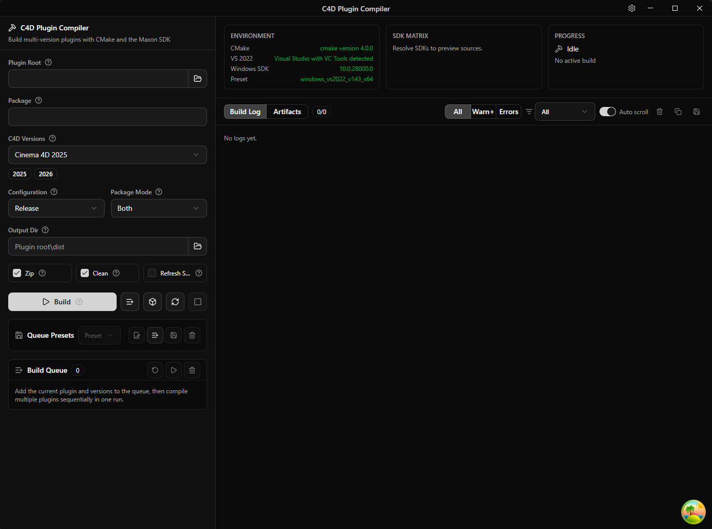

# C4D Plugin Compiler

简体中文 | [English](README.md)

C4D Plugin Compiler 是一个用于 Cinema 4D C++ 插件的桌面编译与打包工具。它可以准备 Maxon C++ SDK 来源，检测本机 Windows 构建环境，执行官方 CMake preset 构建流程，并把编译后的插件整理为可直接在 Cinema 4D 中指认的插件文件夹。



应用基于 Tauri 2、Rust、React 和 TypeScript 构建，并基于 [DunHouGo/tauri-desktop-starter](https://github.com/DunHouGo/tauri-desktop-starter) 模板扩展，加入 Cinema 4D SDK 发现、构建调度、插件打包和 updater 发布流程。当前工作流支持 Cinema 4D 2024.4 及之后版本的 Windows 与 macOS 构建。

## 功能

- 管理一个共享 SDK 根目录，用于 Cinema 4D 2024.4、2025 和 2026 SDK。
- 检测本机 Cinema 4D 安装，并映射到匹配的 Maxon C++ SDK 版本。
- 缺少 SDK 时自动下载或复用已缓存的 SDK 压缩包。
- 构建前检测 CMake、Visual Studio 2022、Windows SDK 和 SDK 可用性。
- 通过 Maxon 官方 CMake preset 工作流构建 C++ 插件。
- 生成合并包、分版本包和可选 zip 发布包。
- 复制插件资源文件，确保每个输出文件夹都可以直接作为 Cinema 4D 插件选择。
- 构建前预览输出文件树。

## 环境要求

- Windows 或 macOS
- Node.js 20+
- Rust stable
- CMake
- Windows 需要 Visual Studio 2022、MSVC C++ 构建工具和 Windows SDK
- macOS 需要 Xcode、Clang 和 Python 3.8
- 需要本机 SDK 检测时安装 Cinema 4D 2024.4 或之后版本

## 快速开始

```bash
vp install
vpr dev
```

发布构建：

```bash
vpr tauri build
```

只做构建检查、不生成安装包：

```bash
vpr tauri build --no-bundle
```

## 基本流程

1. 在 SDK Sources 面板设置 **SDK Root**。
2. 点击 **Auto Detect** 或 **Refresh** 检测本机 Cinema 4D 安装和可用 SDK。
3. 设置 **Plugin Root**、**Module**、**Package**、目标 C4D 版本、构建配置、打包模式和输出目录。
4. 在 **Output Preview** 中确认输出目录结构。
5. 点击 **Build** 解析 SDK、编译模块并打包产物。

详细用户指南见 [readme-cn.md](readme-cn.md)。

## 项目结构

| 路径 | 说明 |
| ---- | ---- |
| `src/` | React 前端源码 |
| `src-tauri/` | Rust 和 Tauri 后端源码 |
| `locales/` | 应用本地化文件 |
| `configs/` | 本地配置模板和 SDK 来源配置 |
| `docs/developer/` | 架构和开发文档 |

## 开发命令

项目使用 Vite+ 命令入口。

```bash
vp install
vpr typecheck
vpr test:run
vpr rust:fmt:check
vpr rust:clippy
vpr tauri build --no-bundle
```

## GitHub 发布和自动更新

推送 `v*` tag 时，GitHub Actions 会构建 Windows 和 macOS 发布产物，并自动创建正式 GitHub Release。Release 会包含 Windows MSI/NSIS 安装包、macOS DMG/app 包、updater 签名文件和 `latest.json`。

首次发布前，在 GitHub Actions Secrets 中添加：

- `TAURI_SIGNING_PRIVATE_KEY`：`C:\Users\DunHou\.tauri\c4d-plugin-compiler-updater.key` 的文件内容

当前本地 updater 密钥没有设置密码，所以 `TAURI_SIGNING_PRIVATE_KEY_PASSWORD` 可以不填。

发布版本：

```bash
git tag v0.1.5
git push origin v0.1.5
```

自动更新端点已经配置为：

```text
https://github.com/DunHouGo/C4D-Plugin-Complier/releases/latest/download/latest.json
```

## 许可证

本项目使用 [GNU General Public License v2.0 only](LICENSE.md) 许可证。
