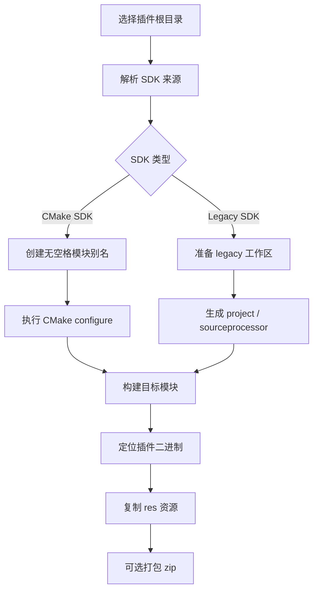

# C4D Plugin Compiler 原理与流程

## 工具原理

C4D Plugin Compiler 的核心思路，是把 Cinema 4D C++ 插件的源代码、资源文件、SDK 版本、构建目录和打包输出分开管理，再用一条固定的后台流水线串起来。

它做的不是直接改插件业务逻辑，而是：

- 识别插件根目录和 SDK 根目录
- 用无空格的中转目录建立模块别名，避免路径和空格干扰 SDK 生成器
- 调用 Maxon 官方 CMake preset 或 legacy `projecttool` / sourceprocessor 流程
- 收集构建产物
- 把二进制和 `res` 目录一起打包成可安装插件

这样做的好处是，插件源代码只关注业务逻辑，构建工具只负责环境准备和产物整理。

## 内部流程

## 关键设计点

- `res` 是插件资源的唯一来源，构建结果里的临时副本不应该反向参与源代码编译。
- 生成目录和输出目录都属于中间产物，出现问题时可以重建，不应该作为源码依赖。
- 资源头文件应明确指向真实 `res/description`，即使旧生成文件存在，也不会优先命中。
- Windows 和 macOS 的构建分支共享同一套上层调度，差异只体现在 SDK 生成器和本地构建命令。

## 本次问题的根因

这次报错不是插件逻辑本身错了，而是 legacy 构建后处理把 `dist-test-debug` 放进了头文件搜索路径之前，导致：

- `vpboghmawatermark.h` 先命中旧副本
- 新增的 `VP_BOGHMA_GROUP_LICENSE` / `VP_BOGHMA_LICENSE_MANAGER` 没有被看到
- `switch case` 里的常量变成未定义标识符

最稳的修法有两层：

- 源码里显式包含 `../res/...`
- 工程文件里移除 `dist-test-debug` 的 include / file reference

## 为什么会出现 `boghma.png` 读取错误

后处理逻辑为了修补旧工程文件，曾经遍历整个插件目录并尝试按 UTF-8 读取文件。
这会把 `res/boghma.png` 这类二进制资源也扫进去，于是触发 `stream did not contain valid UTF-8`。

现在的修复把扫描范围收紧到白名单文本文件：

- `.vcxproj`
- `.vcxproj.filters`
- `SConscript`
- `.cbp`
- `project.pbxproj`

这样二进制资源就不会再被误读。

## 构建链路

## 结论

这个工具的目标，不是让源码不断适配临时生成物，而是让生成物尽量稳定地服从源码结构。
所以最稳的策略永远是：

- 源码明确指向真实 `res`
- 工程修补只碰文本工程文件
- 二进制资源永远不进入 UTF-8 修补流程
